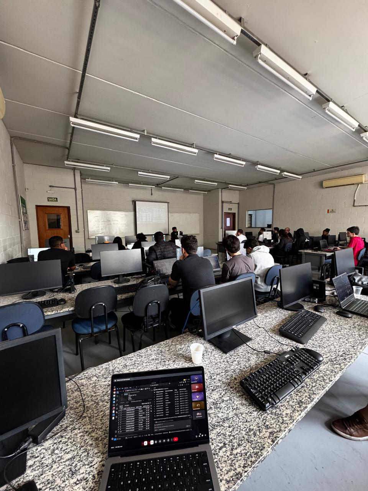
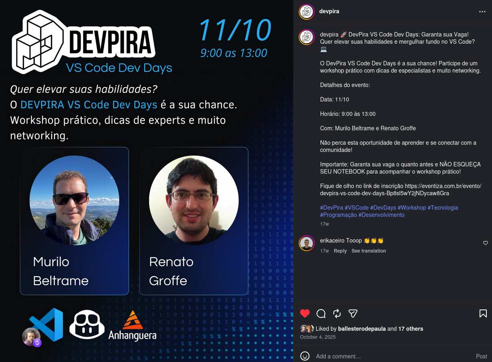
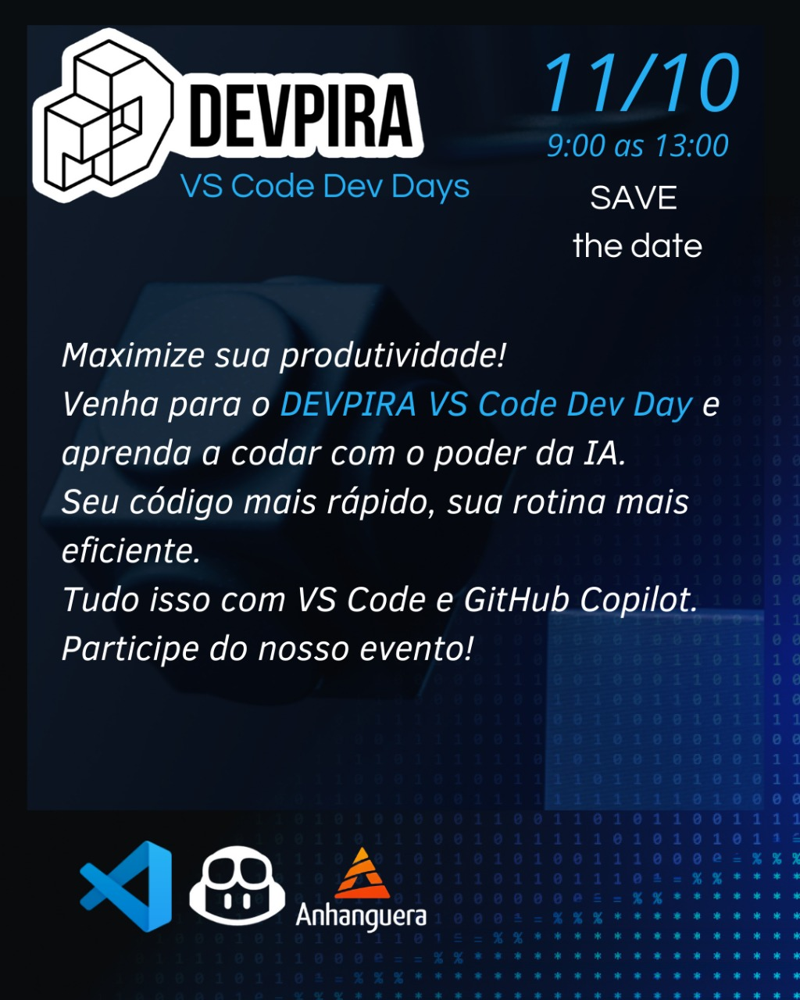

# vscode-dev-days-2025-10-piracicaba

Fotos e informações da edição local do **VS Code Dev Days** em **Piracicaba-SP**, um evento que aconteceu no dia **11/10/2025 (sábado)**.

Organizadores:
- **Alexandre Ballestero de Paula (DEVPIRA)**
- **Renato Groffe (Microsoft MVP, Docker Captain, APISec U Ambassador, MTAC)**
- **Fábio Baldin (DEVPIRA)**
- **Murilo Beltrame (DEVPIRA)**

Número de participantes: **33 pessoas**

---

Apresentações/painéis que aconteceram durante o evento...

---

Acesse este [**link**](/img/) para visualizar todas as fotos das apresentações.

Formulário utilizado para inscrições: [**Eventiza**](https://eventiza.com.br/evento/devpira-vs-code-dev-days-Bp8sl5wY2jNDycaw8Gra)

Divulgação em redes sociais: [**Instagram**](https://www.instagram.com/p/DPYjiMUkyHb/)

Local: **Faculdade Anhanguera - Rua Santa Catarina, 1005 - Vila Gertrudes - Piracicaba-SP - CEP: 04705-000**

Deixamos aqui nossos agradecimentos à **Profa. Thalita Moschini Cavalcanti Terrini (Faculdade Anhanguera)** pela oportunidade e todo o apoio para promovermos esta edição local do VS Code Dev Days em Piracicaba-SP.

---

Murilo palestrando

2

4

8

Workshop

79

95

82

