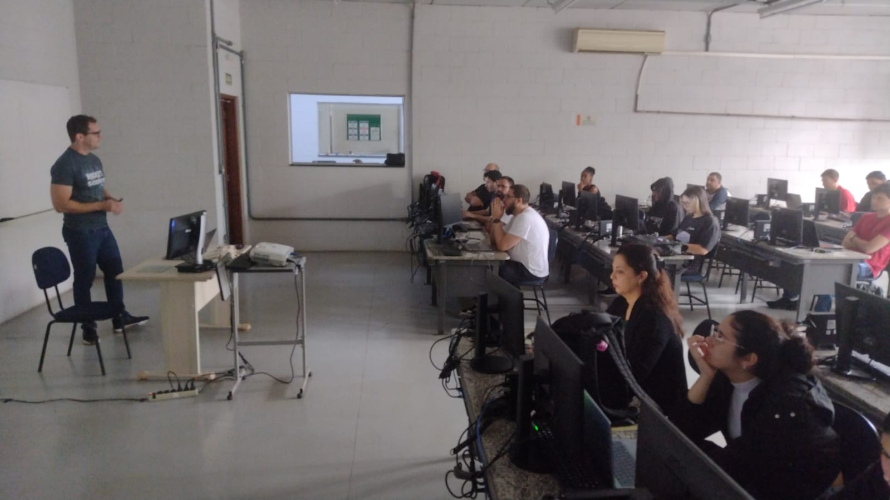
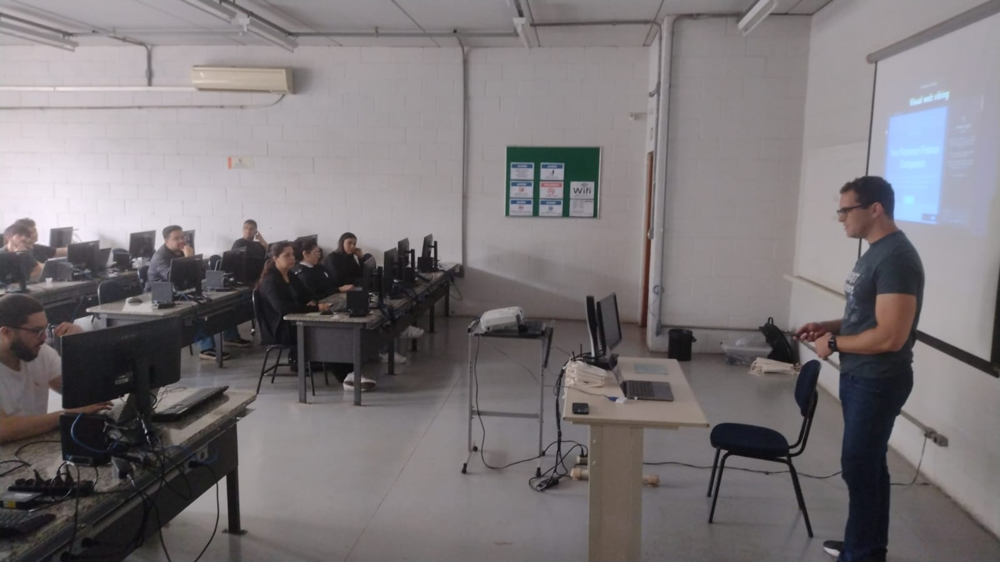
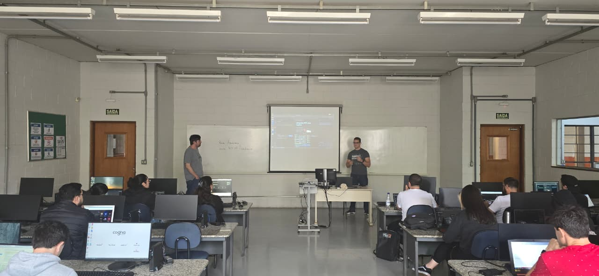

# vscode-dev-days-2025-10-piracicaba

Fotos e informações da edição local do **VS Code Dev Days** em **Piracicaba-SP**, um evento que aconteceu no dia **11/10/2025 (sábado)**.

Organizadores:
- **Alexandre Ballestero de Paula (DEVPIRA)**
- **Renato Groffe (Microsoft MVP, Docker Captain, APISec U Ambassador, MTAC)**
- **Fábio Baldin (DEVPIRA)**
- **Murilo Beltrame (DEVPIRA)**

Número de participantes: **33 pessoas**

Conteúdos (slides + exercício) utilizados durante o evento: **https://github.com/dev-pira/vs-code-dev-days-2025**

---

Apresentações que aconteceram durante o evento...

_# Técnicas Essenciais para uso do GitHub Copilot no VS Code_

Palestrante: **Murilo Beltrame (DEVPIRA)**

Tecnologias e tópicos abordados: **Visual Studio Code, GitHub Copilot, Agents, IAs Generativas, LLMs, .NET...**

_# Model Context Protocol (MCP) - Descomplicando integrações no mundo da IA: uma visão geral_

Palestrante: **Renato Groffe (Microsoft MVP, Docker Captain, APISec U Ambassador, MTAC)**

Tecnologias e tópicos abordados: **Inteligência Artificial, LLMs, MCP, GitHub Copilot, Visual Studio Code, Docker, Docker Compose, Docker MCP Catalog, .NET, ASP.NET Core, C#, Azure API Management, Java, Node.js, Python, Claude, Cursor, OpenAI, PostgreSQL, SQL Server, Linux...**

---

E tivemos ainda uma sessão prática com o **Workshop "Integre MCP com GitHub Copilot¨**.

Instrutores:
- **Renato Groffe (Microsoft MVP, Docker Captain, APISec U Ambassador, MTAC)**
- **Murilo Beltrame (DEVPIRA)**

Tecnologias e tópicos abordados: **Inteligência Artificial, LLMs, MCP, GitHub Copilot, Visual Studio Code, Docker, Python, Linux, GitHub Codespaces...**

---

Acesse este [**link**](/img/) para visualizar todas as fotos das apresentações.

Formulário utilizado para inscrições: [**Eventiza**](https://eventiza.com.br/evento/devpira-vs-code-dev-days-Bp8sl5wY2jNDycaw8Gra)

Divulgação em redes sociais: [**Instagram**](https://www.instagram.com/p/DPYjiMUkyHb/)

Local: **Faculdade Anhanguera - Rua Santa Catarina, 1005 - Vila Gertrudes - Piracicaba-SP - CEP: 04705-000**

Deixamos aqui nossos agradecimentos à **Profa. Thalita Moschini Cavalcanti Terrini (Faculdade Anhanguera)** pela oportunidade e todo o apoio para promovermos esta edição local do VS Code Dev Days em Piracicaba-SP.

---

